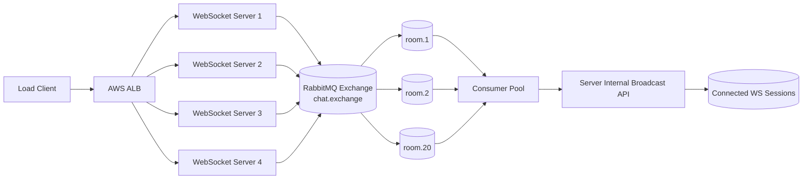
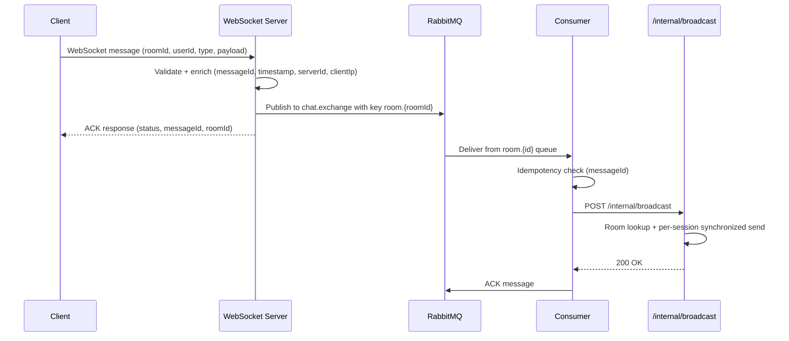

# CS6650 Assignment 2 - Architecture Document

## 1. System Architecture Diagram

## 2. Message Flow Sequence Diagram

## 3. Queue Topology Design

- Broker: RabbitMQ on dedicated EC2 instance.
- Exchange: `chat.exchange` (type: topic, durable).
- Routing key: `room.{roomId}`.
- Queues: `room.1` to `room.20` (durable).
- Queue controls:
  - `x-message-ttl`: 120000 ms
  - `x-max-length`: 50000
- Delivery mode: persistent messages.
- Consumer prefetch: configurable (`rabbitmq.prefetch`).

## 4. Consumer Threading Model

- Single AMQP connection: `consumer-pool`.
- N worker threads (configurable with `consumer.worker-count`; current default 10).
- Each worker owns one channel and consumes a fair subset of room queues.
- Message handling per worker:
  1. Deserialize message.
  2. Deduplicate using in-memory TTL cache.
  3. Forward to server internal broadcast endpoint(s).
  4. ACK on success.
  5. NACK with `requeue=false` on terminal failure.

## 5. Load Balancing Configuration

- Front door: AWS Application Load Balancer.
- Target group: all WebSocket server instances.
- Sticky sessions: enabled for stable WebSocket affinity.
- Health check:
  - Path: `/health`
  - Interval: 30s
  - Timeout: 5s
  - Healthy threshold: 2
  - Unhealthy threshold: 3
- Idle timeout: > 60 seconds for WebSocket support.

## 6. Failure Handling Strategies

- Producer-side:
  - RabbitMQ channel pooling to avoid connection churn.
  - Publisher confirms enabled.
  - Publish failure tracked in metrics (`publishedFailed`).
- Consumer-side:
  - Retry wrapper for broadcast HTTP calls.
  - Idempotency cache to ignore duplicate messageIds.
  - Terminal failures are dropped (`requeue=false`) to avoid poison-message loops.
- WebSocket broadcast:
  - Per-session send lock prevents concurrent writes (`TEXT_PARTIAL_WRITING` issue).
- Health/observability:
  - Server `/health`: rooms, sessions, activeUsers, publish/broadcast counters.
  - Consumer `/health` and `/metrics`: processed, forwarded, failed, throughput.

## 7. Design Notes (Brief)

- Assignment 2 extends Assignment 1 by decoupling ingest from distribution via RabbitMQ.
- This architecture provides at-least-once delivery with idempotent processing.
- Horizontal scaling is done by adding server instances behind ALB and tuning consumer concurrency.
